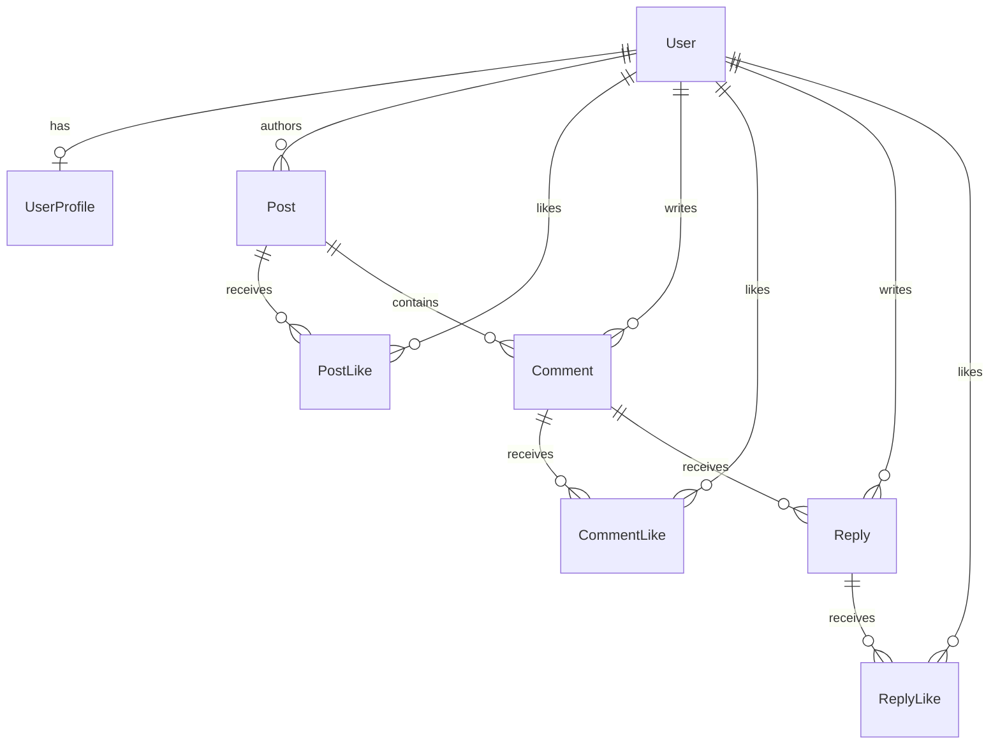

# Buddy Script - Social Feed Project Documentation

Buddy Script is a modern, high-performance, full-stack social media feed application built on a premium Next.js and Node.js architecture. The project is designed with performance, UX responsiveness, and horizontal database scaling in mind.

---

## 🛠 Tech Stack

### Frontend Architecture
* **Core Framework**: Next.js 16 (App Router) - see `appifylab_frontend_task`
* **State Management**: Redux Toolkit (RTK) & RTK Query (located in `./redux`)
* **Authentication**: Next-Auth v4 (Session-based JWT authentication in `./nextAuth`)
* **Styling**: Vanilla CSS (custom premium responsive stylesheet)
* **Dynamic Feed Skeletons & Toasts**: Framer Motion & Sonner

### Backend Architecture
* **Server Framework**: Node.js + Express.js (located in `./src`)
* **ORM (Object Relational Mapper)**: Prisma 6 (schema configuration in `./prisma`)
* **Database**: MongoDB (Atlas)
* **File Uploads**: Multer with DigitalOcean Spaces integration and fallbacks to local storage.

---

## 💾 Database Model (Prisma Schema)

The database schema splits data models logically to support fast reads and clean relational structures:



### Models Overview
1. **User / UserProfile** (`user.prisma`):
   * Stores user registration details (`email`, `password`, `isVerified`).
   * `UserProfile` stores optional info like avatar images, name, and phone.
2. **Post** (`feed.prisma`):
   * Stores post text and image URLs.
   * `visibility` field supports `PUBLIC` and `PRIVATE` enum states.
3. **Likes** (`PostLike`, `CommentLike`, `ReplyLike`):
   * Enforces unique user constraints (`postId_userId`, `commentId_userId`, `replyId_userId`) to prevent double-liking.
4. **Comments & Replies**:
   * Supports structural commenting with nested reply threads.

---

## ⚡ Main Feature Walkthrough

### 1. Authentication & Security
* **Access Control**: Handled on the server via `DashboardLayout` (redirecting to `/auth/login` if no session is active).
* **Auto Login**: After registration completes at the backend, the registration page automatically invokes Next-Auth's credentials provider to sign the user in.
* **Token Sync**: `AuthSyncWithNextAuth` dynamically synchronizes access tokens between the Next-Auth session context and the Redux store.

### 2. High-Performance Feed (Pagination & Queries)
* **Millons of Reads Support**: MongoDB indexes are created on `Post` visibility and author IDs to enable rapid queries.
* **Infinite Scroll**: The client uses `IntersectionObserver` to trigger paginated fetches (fetching 10 posts at a time).
* **Visibility Control**: The backend query filters posts:
  ```typescript
  const where = {
    OR: [
      { visibility: Visibility.PUBLIC },
      { userId: currentUserId },
    ],
  };
  ```
  This ensures private posts are visible **only** to their respective author.

### 3. Redux Optimistic UI & Hover Tooltips
* **Optimistic Patching** (`postApi.ts`):
  * Likes are toggled instantly on the screen before the backend server responds. If the request fails, the cache automatically reverts to its original state.
* **Hover Tooltips** (`LikesList`):
  * Hovering over the likes counts on a post, comment, or reply displays a popup with the list of users who liked it.

---

## 🚀 Running the Project Locally

### Prerequisites
* **Node.js** (v18+)
* **MongoDB Connection String** (Configured in `.env`)

### 1. Backend Setup
1. Open a terminal in backend directory.
2. Install dependencies: `npm install`
3. Generate client files: `npm run pg`
4. Run the development server: `npm run dev` (Runs on `http://localhost:5016`)

### 2. Frontend Setup
1. Open a terminal in frontend directory.
2. Install dependencies: `npm install`
3. Run the development server: `npm run dev` (Runs on `http://localhost:3000`)
